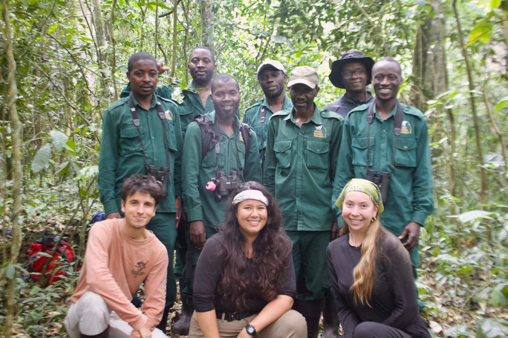

# Behavioral Ecology of Red-Tailed Monkeys (*Cercopithecus ascanius*)
**Research Assistant | Kibale National Park, Uganda**  
*June – September 2026*

---

### Project Overview
During the summer of 2026, I worked as a field research assistant with the Ngogo Monkey Project in Kibale National Park, southwestern Uganda. My research supported long-term studies on wild primate behavioral ecology, social structures, and collective action, specifically focusing on wild red-tailed monkeys (*Cercopithecus ascanius*).

The research team at the 2026 Ngogo Monkey Project.

---

### Field Methodologies & Core Responsibilities

* **Behavioral Focal Follows:** Conducted daily dawn-to-dusk follows across three habituated wild groups, recording instantaneous scan samples and continuous behavioral data.
* **Simulated Intergroup Engagements (IGEs):** Supported experimental trials simulating territorial incursions using playback experiments to measure collective defense dynamics and individual participation thresholds—specifically among adult females.
* **Non-Invasive Biological Sampling:** Collected and processed fecal and urine samples from identified individuals under strict contamination-free protocols for subsequent hormonal analysis (glucocorticoids/reproductive hormones) and genetic profiling at the University of Minnesota.
* **Data Integrity & Log Tracking:** Transcribed daily audio logs and maintained multi-group demographic records and ranging maps.

---

### Key Takeaways & Research Synthesis
This immersive field season provided firsthand experience in wild primate behavioral observation, non-invasive biomarker sampling in dense tropical rainforest environments, and rigorous quantitative data management. Bridging these behavioral-ecological field methods with evolutionary models directly informs my broader perspective on sociality, spatial territoriality, and human-environment interactions.

---

[← Back to Home](/)
